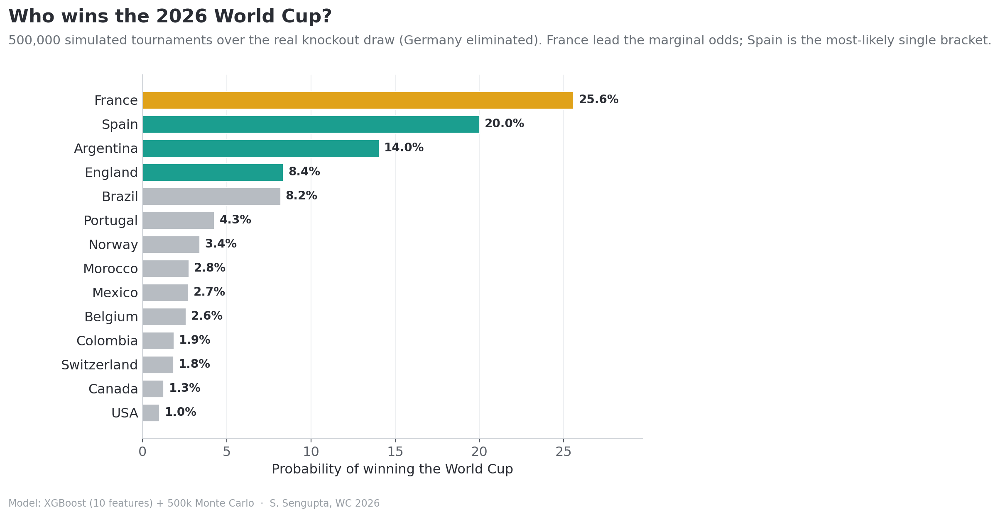

# World Cup 2026 — Machine-Learning Prediction Pipeline

A game-by-game probabilistic forecast of the **FIFA World Cup 2026**, built from an XGBoost
match-outcome model and a 500,000-run Monte Carlo tournament simulation, updated live as
results come in.

**🔴 Live bracket:** https://srotriyosengupta.github.io/wc2026-prediction/

*By Srotriyo Sengupta.*

---

## What it does

The goal is **not** "pick the winner." It is the narrower, more honest question: *if these two
teams played right now, what is the probability of each outcome — home win, draw, or away win?*

So the problem is framed as **probabilistic 3-class classification**. The model emits three
**calibrated** probabilities that sum to one (e.g. `France 61% / draw 24% / opponent 15%`),
not a hard result. Those per-match distributions then feed a **Monte Carlo simulation**: sample
a result from each match, advance the winner through the real confirmed bracket, play to the
final — then repeat 500,000 times. A team's title odds are simply the share of those tournaments
it survives.

### Current headline (group stage complete, knockouts underway)

- **Most-likely bracket (chalk):** **Spain** champions, beating Argentina **66.5%** in the final;
  Spain edge France **59.1%** in the semis.
- **Marginal title odds (500k sim):** **France 25.6%** · Spain 20.0% · Argentina 14.0% ·
  England 8.4% · Brazil 8.2% · Portugal 4.3%.
- The chalk winner (Spain) is **not** the favourite in the marginal odds (France) — the gap
  between the *modal* path and the *marginal* distribution is the central story.
- **14 of 16 Round-of-32 games are played and the model called every winner correctly**
  (Germany & Netherlands both out on penalties; France, Spain, Portugal, England, Mexico,
  USA, Switzerland, Belgium, Norway, Egypt all as predicted). Completed results are locked
  into the simulation; only Argentina–Cabo Verde and Colombia–Ghana remain to play.



---

## How it works

| Step | What happens |
|------|--------------|
| **0. Training data** | 980 international matches. Spine is StatsBomb major-tournament data (World Cups 2018/2022, Euro 2020/2024, Copa América, AFCON ≈ 314 fully-detailed games) plus ~666 additional international results. Each match carries a **tournament weight** (WC 1.0 → friendly 0.15) that drives ELO and form, not the classifier loss. |
| **1. Team strength** | **ELO** ratings (chess-style, `K = 32 × (1 + tournament_weight)`). 2026 is seeded with pre-tournament ratings from worldcupelo.com — Spain 2171, Argentina 2113, France 2063, England 2042. |
| **2. Features** | Every matchup → **10 home-minus-away difference features**: ELO, net xG, club xG, attack quality, club prestige, squad chemistry, international experience, squad disruption, Ballon d'Or 2025 talent, and a knockout-stage flag. Attack/prestige/chemistry are position-weighted (FW 4× / MF 2× / DF 1×). |
| **3. Model** | **XGBoost** `multi:softprob`, 3 classes — 500 trees, depth 5, lr 0.05, 0.8 subsample/colsample, `reg_lambda=5`, `min_child_weight=4`. Calibrated with **per-class isotonic regression on 5-fold out-of-fold predictions**, renormalised to sum to 1. |
| **4. Simulation** | 500k Monte Carlo over the real confirmed bracket. Knockout ties resolve as `P(win) + ½·P(draw)`; completed results are locked. |
| **5. Live update** | Each result updates ELO and the bracket, then the whole sim reruns. An **in-tournament form** signal (opponent-adjusted goal-difference z-score, capped ±6%) captures who is actually performing — not just who looks good on paper. |

### Manual adjustments (where judgment enters, stated openly)

- **Host familiarity** — small ±4% boost for the USA/Canada/Mexico co-hosts (a setup the model has never seen).
- **Chemistry floor** — keeps elite players at lower-prestige clubs (e.g. Messi/De Paul at Inter Miami) from being undervalued.
- **In-tournament form** — the ±6% live-form layer described above.

---

## Honest performance (out-of-fold, 5-fold CV)

| Metric | Model | Baseline |
|--------|------:|---------:|
| Log-loss (calibrated, OOF) | **0.942** | base-rate 1.065 |
| Log-loss (raw, OOF) | 1.032 | uniform `ln 3` = 1.099 |
| Top-pick accuracy (OOF) | **54.7%** | majority-class 43.7% |

A real but *modest* edge — the correct order of magnitude for three-way football outcomes.
(These are out-of-fold, not in-sample.)

---

## Repository layout

```
.
├── index.html                 # the live GitHub Pages bracket site
├── run_pipeline.py            # master entry point (data → features → train → simulate)
├── simulate_real_bracket.py   # 500k Monte Carlo over the real confirmed knockout draw
├── make_article_charts.py     # figures fig1–fig8
├── make_ml_figures.py         # technical ML figures (SHAP, calibration, convergence, posterior)
├── regen_fig12.py             # regenerate title-odds + progression charts only
├── configs/config.yaml        # data sources, leagues, StatsBomb competition IDs
├── src/
│   ├── features.py            # player → squad feature engineering
│   ├── model.py               # ELO, training, calibration, live-ELO update
│   ├── predict_bracket.py     # deterministic chalk bracket
│   ├── simulation.py          # Monte Carlo engine + ProbabilityCache
│   └── ingest/                # data pulls: squads, international, club seasons, coaches, live results
├── data/processed/            # committed feature parquets (raw data is pulled at runtime)
├── outputs/                   # trained model, OOF eval cache, simulation results
├── article_charts/            # publication figures (PNG) + quantitative_results.md
└── cluster/                   # SLURM sbatch scripts for GPU runs (Rutgers Amarel)
```

---

## Quick start

Requires **Python 3.10+**.

```bash
pip install -r requirements.txt
```

The processed feature parquets, the trained model, and the OOF eval cache are committed, so you
can reproduce the model evaluation, the simulation, and every figure **without re-pulling any raw
data**. Run everything from the repository root with `PYTHONPATH=.`.

```bash
# Re-run the 500k Monte Carlo over the real confirmed knockout draw
PYTHONPATH=. python3 simulate_real_bracket.py        # → outputs/live_simulation_500k.csv

# Regenerate the publication figures
PYTHONPATH=. python3 make_article_charts.py          # fig1–fig8
PYTHONPATH=. python3 make_ml_figures.py              # SHAP, calibration, convergence, posterior

# Inspect the deterministic chalk bracket
PYTHONPATH=. python3 -c "from src.predict_bracket import predict, elo_live; print(predict('Spain','Argentina',is_knockout=True,elo=elo_live))"
```

### Full pipeline (re-pulls raw data)

Raw StatsBomb events (via `statsbombpy`) and FBref club seasons are **not** committed. To rebuild
from scratch:

```bash
python3 run_pipeline.py                  # pull squads + international + club + coaches, build features
python3 run_pipeline.py --skip-club      # skip the slow (~45 min) FBref club pull
python3 run_pipeline.py --features-only  # rebuild features from cached raw data
python3 run_pipeline.py --train          # train + calibrate the XGBoost model
python3 run_pipeline.py --live --n 500000  # simulate forward from the current live WC2026 state
```

Add `--gpu` to train/simulate on CUDA (see `cluster/` for the SLURM batch scripts).

### View the site locally

```bash
python3 -m http.server 8000   # then open http://localhost:8000/index.html
```

---

## Figures (`article_charts/`)

- `fig1_title_odds.png` — Monte Carlo title odds
- `fig2_progression.png` — reach-semis / reach-final / win probabilities
- `fig3_feature_importance.png` — gain-based feature importance
- `fig6_seeded_elo.png` — pre-tournament seeded ELO ratings
- `fig_shap_summary.png` — SHAP beeswarm (what drives a prediction)
- `fig_calibration_curve.png` — reliability diagram (is the model honest?)
- `fig_logloss_convergence.png` — train vs validation log-loss per boosting round
- `fig_mc_convergence.png` — running title-odds estimate vs # simulations
- `fig_posterior_title.png` — Beta posterior on each contender's title probability
- `fig5_corners.png` — scraped game-by-game corner stats
- `quantitative_results.md` — full numeric results table

---

## Data sources

- **StatsBomb** (`statsbombpy`) — World Cup, Euro, Copa América, AFCON match events
- **FBref** — club-season player stats (2021–2026) for chemistry / xG / prestige features
- **worldcupelo.com** — pre-tournament seeded ELO ratings
- **Ballon d'Or 2025** rankings — individual-brilliance feature
- **FotMob** — live WC2026 results (curated in `src/ingest/live_results.py`)

> The model is a measurement of uncertainty, not a prophecy. The bracket shown is the
> *most-likely* path, not the *expected* one — a 68% favourite still loses about a third of the
> time. Red cards, injuries, and penalty shootouts are exactly the chaos this exists to quantify,
> not eliminate.
